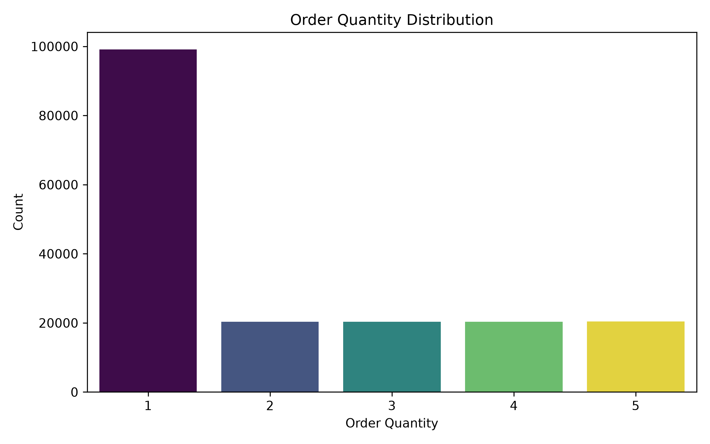
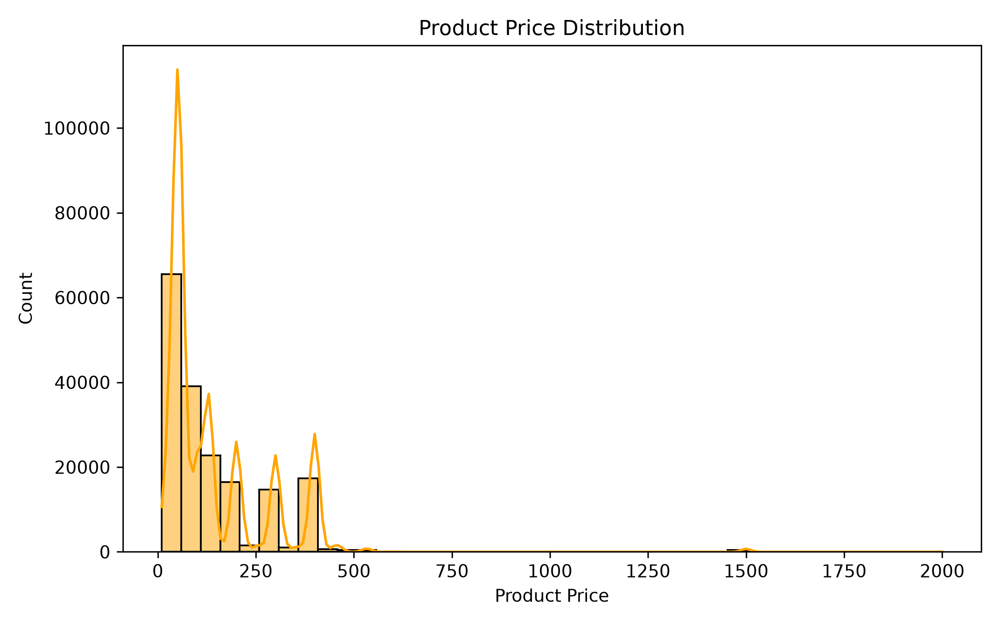
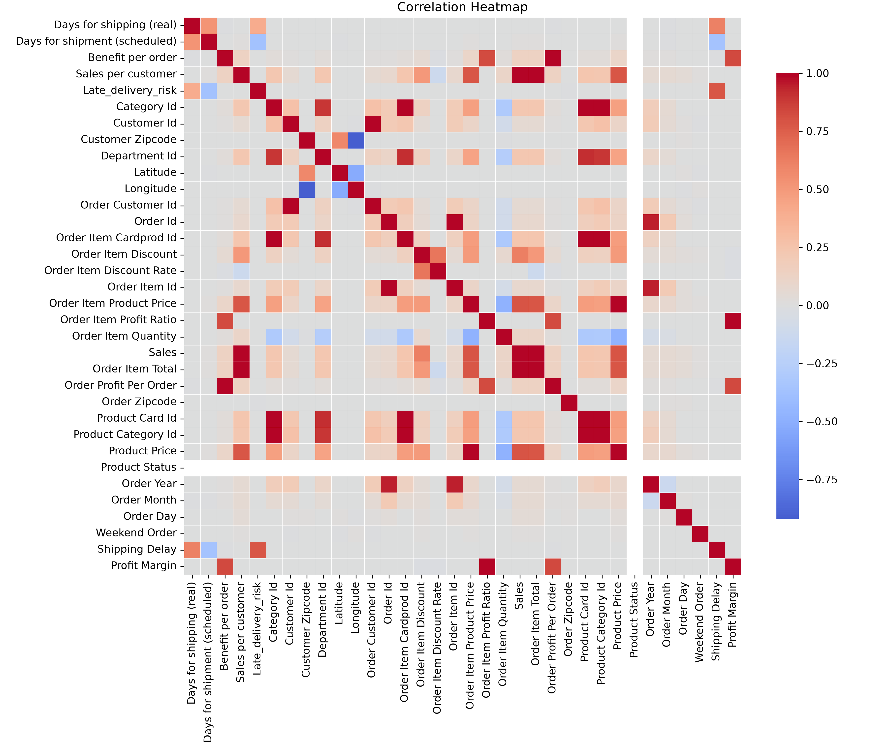
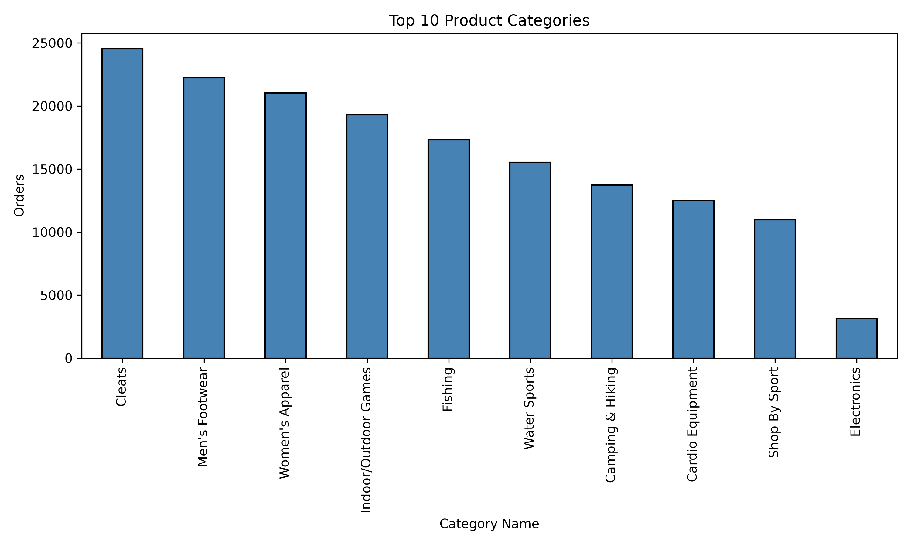
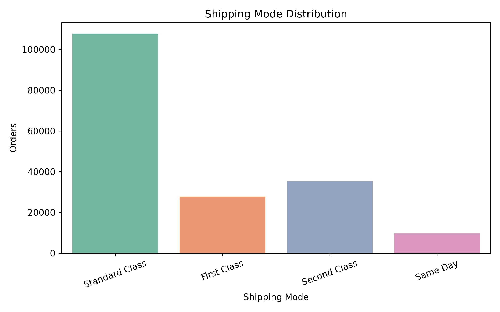
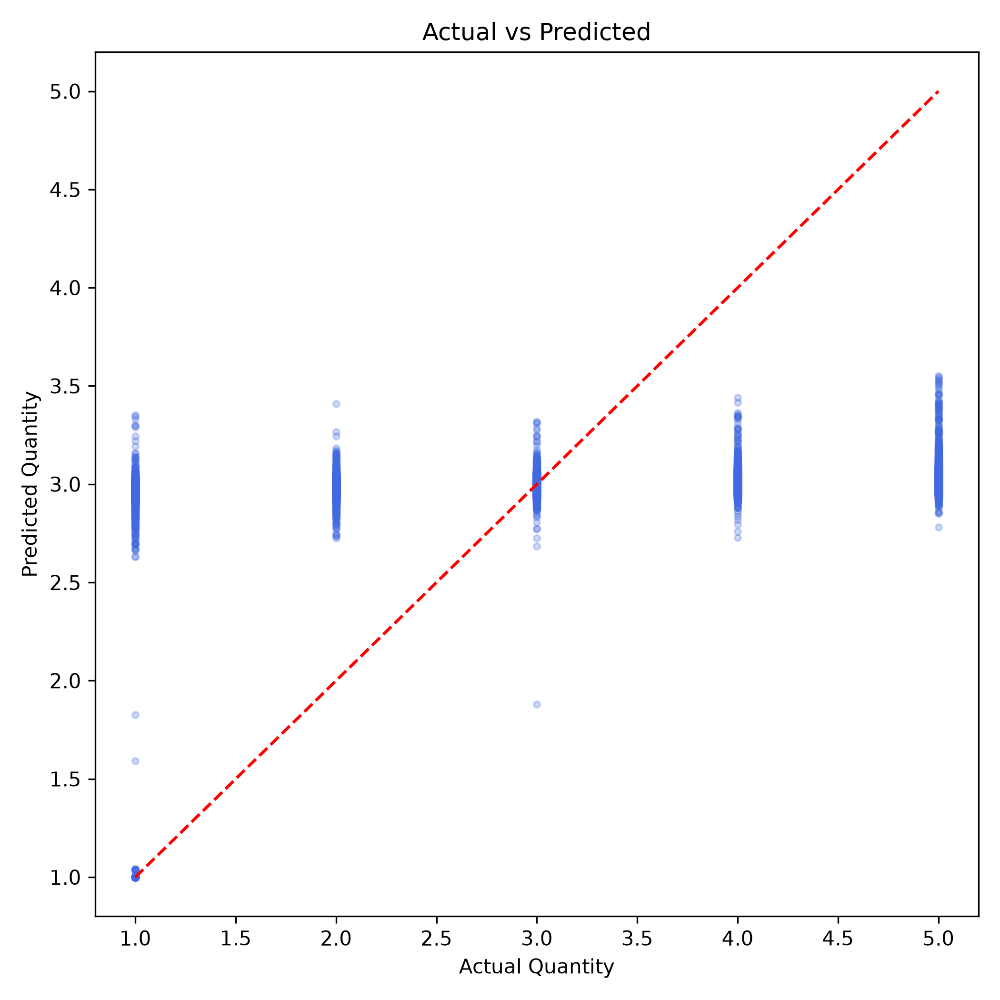
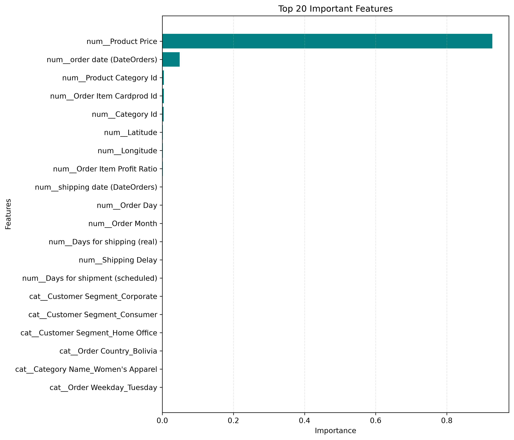

# Enterprise Supply Chain Market Intelligence

An end-to-end AI/Data Analytics project for supply chain intelligence using Python, data analysis, visualization, and machine learning.

## Tech Stack

- Python
- Pandas
- NumPy
- Scikit-learn
- Streamlit
- Plotly

# Enterprise Supply Chain Market Intelligence

An end-to-end Machine Learning project for Supply Chain Analytics that predicts **Order Item Quantity** using historical supply chain data and provides business insights through interactive visualizations.

---

# Project Overview

This project focuses on:

- Data Cleaning & Feature Engineering
- Exploratory Data Analysis (EDA)
- Demand Prediction using Machine Learning
- Feature Importance Analysis
- Business Visualizations

The trained model predicts **Order Item Quantity**, helping businesses improve inventory planning and demand forecasting.

---

# Project Structure

```
Enterprise-Supply-Chain-Market-Intelligence/

│
├── data/
│   ├── raw/
│   └── processed/
│
├── models/
│   └── random_forest_model.pkl
│
├── results/
│   ├── actual_vs_predicted.png
│   ├── correlation_heatmap.png
│   ├── feature_importance.csv
│   ├── feature_importance.png
│   ├── feature_importance_visualization.png
│   ├── model_metrics.csv
│   ├── order_quantity_distribution.png
│   ├── product_price_distribution.png
│   ├── shipping_mode_distribution.png
│   └── top_categories.png
│
├── src/
│   ├── feature_engineering.py
│   ├── model_training.py
│   └── visualization.py
│
├── requirements.txt
├── README.md
└── app.py
```

---

# Technologies Used

- Python
- Pandas
- NumPy
- Matplotlib
- Seaborn
- Scikit-Learn
- Joblib

---

# Machine Learning Model

Algorithm Used:

- Random Forest Regressor

Evaluation Metrics:

- MAE
- RMSE
- R² Score

---

# Visualizations

## 1. Order Quantity Distribution

Shows how frequently each order quantity appears.



---

## 2. Product Price Distribution

Distribution of product prices across the dataset.



---

## 3. Correlation Heatmap

Correlation among all numerical features.



---

## 4. Top Product Categories

Most frequently ordered product categories.



---

## 5. Shipping Mode Distribution

Distribution of different shipping methods.



---

## 6. Actual vs Predicted

Comparison between actual and predicted order quantities.



---

## 7. Feature Importance

Top features used by the Random Forest model.



---

# 📈 Model Performance

| Metric   | Value  |
| -------- | ------ |
| MAE      | 0.6753 |
| RMSE     | 1.0612 |
| R² Score | 0.4703 |

---

# ▶️ How to Run

Clone the repository

```bash
git clone https://github.com/yourusername/Enterprise-Supply-Chain-Market-Intelligence.git
```

Install dependencies

```bash
pip install -r requirements.txt
```

Run feature engineering

```bash
python src/feature_engineering.py
```

Train model

```bash
python src/model_training.py
```

Generate visualizations

```bash
python src/visualization.py
```

---

# 📁 Output

The project generates:

- Trained ML Model
- Feature Importance CSV
- Model Metrics
- Seven Business Visualizations

inside the **results/** folder.

---

# 👨‍💻 Author

**Kanak Sharma**

AI / Machine Learning Enthusiast

GitHub: https://github.com/kanak12219836

LinkedIn: https://www.linkedin.com/in/kanak-sharma-bb450b1a0/
